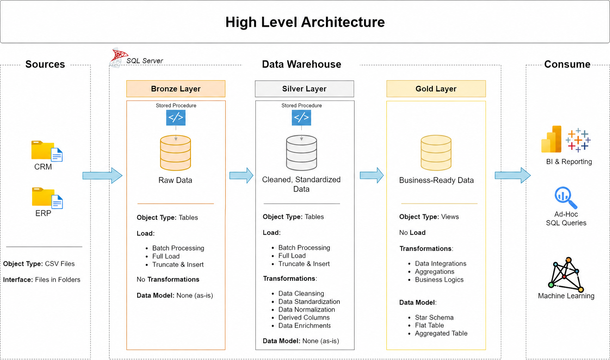

# Data Warehouse and Analytics Project

Welcome to the **Data Warehouse and Analytics Project** repository! 🚀  
This project demonstrates a comprehensive data warehousing and analytics solution, from building a data warehouse to generating actionable insights. Designed as a template/portfolio repository, it highlights industry best practices in data engineering and analytics.

---
## 🏗️ Data Architecture

The data architecture for this project follows the Medallion Architecture with **Bronze**, **Silver**, and **Gold** layers:


1. **Bronze Layer**: Stores raw data as-is from the source systems. Data is ingested from CSV files into a SQL Server Database.
2. **Silver Layer**: Cleanses, standardizes, and normalizes data to prepare it for detailed analysis.
3. **Gold Layer**: Houses business-ready data modeled into a star schema required for reporting and analytics.

---
## 📖 Project Overview

This project encompasses:

1. **Data Architecture**: Designing a Modern Data Warehouse using Medallion Architecture (**Bronze**, **Silver**, and **Gold** layers).
2. **ETL Pipelines**: Extracting, transforming, and loading data from source systems into the warehouse.
3. **Data Modeling**: Developing fact and dimension tables optimized for analytical queries.
4. **Analytics & Reporting**: Creating SQL-based reports and dashboards to derive actionable business insights.

🎯 This repository provides a reference implementation for concepts in:
- SQL Development
- Data Architecture
- Data Engineering  
- ETL Pipeline Design  
- Data Modeling  
- Data Analytics  

---

## 🛠️ Essential Tools & Resources

- **[Datasets](datasets/):** Project datasets (CSV files).
- **[SQL Server Express](https://www.microsoft.com/en-us/sql-server/sql-server-downloads):** Lightweight database engine for hosting the data warehouse.
- **[SQL Server Management Studio (SSMS)](https://learn.microsoft.com/en-us/sql/ssms/download-sql-server-management-studio-ssms):** Integrated environment for managing SQL infrastructure.
- **[Draw.io](https://www.drawio.com/):** Visual tool for designing architecture diagrams and data models.

---

## 🚀 Project Requirements

### Building the Data Warehouse (Data Engineering)

#### Objective
Develop a modern data warehouse using SQL Server to consolidate sales data, enabling analytical reporting and informed decision-making.

#### Specifications
- **Data Sources**: Import data from two source systems (ERP and CRM) provided as CSV files.
- **Data Quality**: Cleanse and resolve data quality issues prior to downstream ingestion.
- **Integration**: Combine both sources into a unified, user-friendly data model optimized for analytical queries.
- **Scope**: Focus on the latest snapshot dataset; historical tracking (SCD) is not required.
- **Documentation**: Provide clear documentation of the data model to support analytics and business stakeholders.

---

### BI: Analytics & Reporting (Data Analysis)

#### Objective
Develop SQL-based analytics to deliver actionable insights into:
- **Customer Behavior**
- **Product Performance**
- **Sales Trends**

---

## 📂 Repository Structure
```
data-warehouse-project/
│
├── datasets/                           # Raw datasets used for the project (ERP and CRM data)
│
├── docs/                               # Project documentation and architecture details
│   ├── data_architecture.drawio        # Draw.io file shows the project's architecture
│   ├── data_catalog.md                 # Catalog of datasets, including field descriptions and metadata
│   ├── data_models.drawio              # Draw.io file for data models (star schema)
│   ├── naming-conventions.md           # Consistent naming guidelines for tables, columns, and files
│
├── scripts/                            # SQL scripts for ETL and transformations
│   ├── bronze/                         # Scripts for extracting and loading raw data
│   ├── silver/                         # Scripts for cleaning and transforming data
│   ├── gold/                           # Scripts for creating analytical models
│
├── tests/                              # Test scripts and quality files
│
├── README.md                           # Project overview and instructions
├── LICENSE                             # License information for the repository
└── .gitignore                          # Files and directories to be ignored by Git
```
---

## 🛡️ License

This project is licensed under the [MIT License](LICENSE). You are free to use, modify, and distribute this project.
